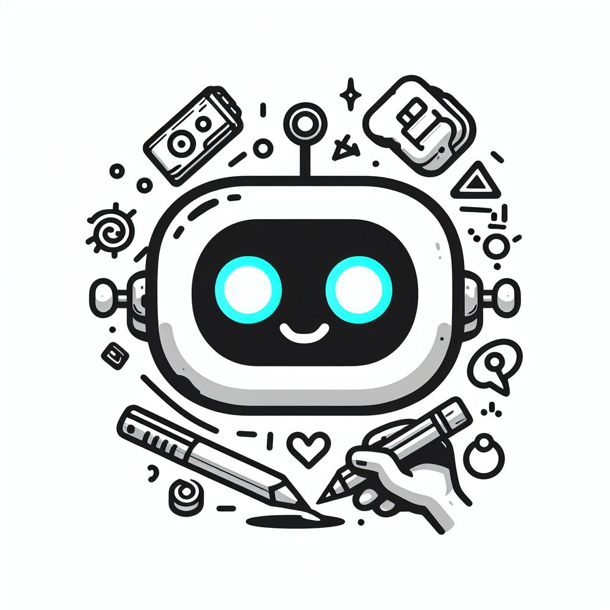

<a name="readme-top"></a>

[![Contributors][contributors-shield]][contributors-url]
[![Forks][forks-shield]][forks-url]
[![Stargazers][stars-shield]][stars-url]
[![Issues][issues-shield]][issues-url]
[![MIT License][license-shield]][license-url]


<br />
<div align="center">
  <a href="https://github.com/oxlac/scribblr">
    
  </a>

<h3 align="center">Scribblr</h3>

  <p align="center">
    A Javascript Deep Learning Project of an online game that uses an AI to guess what players are drawing.
    <br />
    <a href="https://mr-dm.oxlac.com"><strong>Visit the Website »</strong></a>
    <br />
    <br />
    <a href="https://github.com/oxlac/sribblr/issues">Report Bug</a>
    ·
    <a href="https://github.com/oxlac/sribblr/issues">Request Feature</a>
    .
    <a href="https://discord.gg/2YdnSGHdET">Discord Server</a>
  </p>
</div>

<details>
  <summary>Table of Contents</summary>
  <ol>
    <li>
      <a href="#about-the-project">About The Project</a>
      <ul>
        <li><a href="#features">Features</a></li>
      </ul>
      <ul>
        <li><a href="#built-with">Built With</a></li>
      </ul>
    </li>
    <li>
      <a href="#getting-started">Getting Started</a>
      <ul>
        <li><a href="#installation">Installation</a></li>
      </ul>
    </li>
    <li><a href="#usage">Usage</a></li>
    <li><a href="#roadmap">Roadmap</a></li>
    <li><a href="#contributing">Contributing</a></li>
    <li><a href="#license">License</a></li>
    <li><a href="#contact">Contact</a></li>
    <li><a href="#acknowledgments">Acknowledgments</a></li>
  </ol>
</details>


## About The Project

[![Scribble Screenshot][product-screenshot]](https://scribblr.oxlac.com)

An AI web based game that challenges players to sketch objects after which a CNN model makes prediction of what thst object is. 

Similar to [Quick, Draw](https://quickdraw.withgoogle.com/) by Google.

>[!NOTE]
> This is a demonstration project and is intended to showcase the methods that can be used to embed machine learning models directly inside website with the use of javascript

<p align="right">(<a href="#readme-top">back to top</a>)</p>

### Features

Scribblr is made in HTML5 using [Phaser 2 framework](https://phaser.io/) and [TensorFlow.js library](https://js.tensorflow.org/). 

To classify images **Convolutional Neural Network (CNN)** is used.

The model was trained on a small subset of the [Quick Draw Dataset](https://quickdraw.withgoogle.com/data).

### Built With

* [HTML5](https://html.com/)
* [Phaser 2](https://phaser.io/)
* [TensorFlow.js](https://js.tensorflow.org/)
* [Quick Draw Dataset](https://quickdraw.withgoogle.com/data)

<p align="right">(<a href="#readme-top">back to top</a>)</p>


## Getting Started

You can view the live demo of the project at [https://scribblr.oxlac.com](https://scribblr.oxlac.com)

If you want to run the website locally on your machine follow the instructions in the below install section.


### Installation

1. Clone the repo
   ```sh
   git clone https://github.com/oxlac/sribblr.git
   ```
2. Open the cloned folder in VS Code
   ```sh
   code sribblr
   ```
3. Use the VS Code Live Server Extension to run the website locally on your machine.


<p align="right">(<a href="#readme-top">back to top</a>)</p>


<!-- USAGE EXAMPLES -->
## Usage

Once the game is initialized and training is completed, The left table will show the samples from the dataset and the models prediction. 

The wrong predictions will be marked 'Red' and correct predictions will be marked 'Green'. 

You can test with more samples by clicking on 'Next Test' Button.

Initially, The model is trained for 50 epochs. If you are not satisfied with the model predictions, You can train the model more by clicking the 'Train More' Button.

You can start sketching any objects as mentioned in the status bar, and the model will predict your drawing.


<p align="right">(<a href="#readme-top">back to top</a>)</p>


## Roadmap

- [ ] Adding more drawing categories from the [Quick Draw Dataset](https://quickdraw.withgoogle.com/data).

- [ ] Tune Model Architecture for more accuracy.

- [ ] Multiplayer game support

- [ ] Enhance the UI

- [ ] Authentication

- [ ] Create rooms and compete with friends to see who can accurately draw an object that the model can identify first.

See the [open issues](https://github.com/oxlac/sribblr/issues) for a full list of proposed features (and known issues). If you have any other ideas, please open an issue and let us know.

<p align="right">(<a href="#readme-top">back to top</a>)</p>


## Contributing

Contributions are what makes the open-source community such an amazing place to learn, inspire, and create. Any contributions you make are **greatly appreciated**.

If you have a suggestion that would make this better, please fork the repo and create a pull request. You can also simply open an issue with the tag "enhancement".
Don't forget to give the project a star! Thanks again!

1. Fork the Project
2. Create your Feature Branch (`git checkout -b feature/AmazingFeature`)
3. Commit your Changes (`git commit -m 'Add some AmazingFeature'`)
4. Push to the Branch (`git push origin feature/AmazingFeature`)
5. Open a Pull Request

<p align="right">(<a href="#readme-top">back to top</a>)</p>


## License

Distributed under the MIT License. See `LICENSE.txt` for more information.

<p align="right">(<a href="#readme-top">back to top</a>)</p>


## Contact

Your Name - [@Oxlac_](https://twitter.com/Oxlac_) - contact@oxlac.com

Discord Server - [https://discord.gg/2YdnSGHdET](https://discord.gg/2YdnSGHdET)

Project Link: [https://github.com/oxlac/sribblr](https://github.com/oxlac/sribblr)

<p align="right">(<a href="#readme-top">back to top</a>)</p>


<!-- MARKDOWN LINKS & IMAGES -->
<!-- https://www.markdownguide.org/basic-syntax/#reference-style-links -->
[contributors-shield]: https://img.shields.io/github/contributors/oxlac/sribblr.svg?style=for-the-badge
[contributors-url]: https://github.com/oxlac/sribblr/graphs/contributors
[forks-shield]: https://img.shields.io/github/forks/oxlac/sribblr.svg?style=for-the-badge
[forks-url]: https://github.com/oxlac/sribblr/network/members
[stars-shield]: https://img.shields.io/github/stars/oxlac/sribblr.svg?style=for-the-badge
[stars-url]: https://github.com/oxlac/sribblr/stargazers
[issues-shield]: https://img.shields.io/github/issues/oxlac/sribblr.svg?style=for-the-badge
[issues-url]: https://github.com/oxlac/sribblr/issues
[license-shield]: https://img.shields.io/github/license/oxlac/sribblr.svg?style=for-the-badge
[license-url]: https://github.com/oxlac/sribblr/blob/master/LICENSE.txt
[linkedin-shield]: https://img.shields.io/badge/-LinkedIn-black.svg?style=for-the-badge&logo=linkedin&colorB=555

[product-screenshot]: assets/main-image.png

